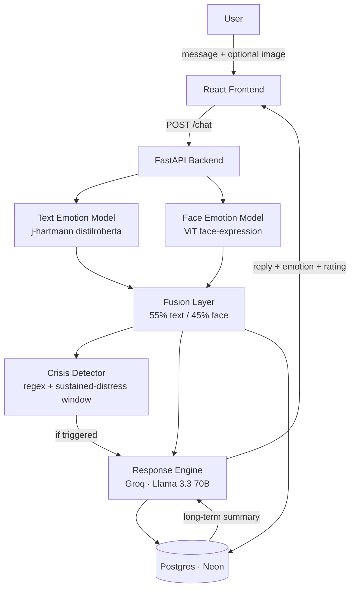

<div align="center">


**An AI journal that reads how you actually feel — through what you write and how you look — and responds like a therapist who remembers your patterns over time.**


</div>

---

## What is this?

MoodScript is a full-stack emotional journaling app. You write (or speak, or show your face) how you're feeling, and it:

1. **Detects your emotion** — from your words, sentence by sentence, and optionally from a photo/webcam frame
2. **Fuses both signals** into one confidence-weighted emotional read
3. **Responds as Aria** — a therapist-persona LLM companion that remembers your last conversation, your last week, and your long-term patterns, not just your last message
4. **Watches for real crisis signals** — and only surfaces helpline resources when something is genuinely serious, never as a reflex
5. **Tracks your wellbeing over time** — a recency-weighted score, trend direction, and a weekly reflection letter written just for you

It's not a chatbot wrapper. Every emotional read is a real model inference (text + vision), fused deterministically, with LIME-based explainability behind a "why?" button on every response.

## Features

**Emotion intelligence**
- Sentence-level text emotion classification (position/length/confidence-weighted aggregation)
- Optional face-image emotion detection (photo upload or webcam)
- Deterministic fusion layer combining both signals into one unified read
- LIME explainability — see exactly which words drove the detected emotion

**Conversation & memory**
- Multi-turn chat with a consistent persona per conversation (4 distinct therapist voices)
- Long-term pattern summarization injected into every reply — Aria references your actual history, not just the current message
- Full conversation history, browsable per-thread from the sidebar

**Insight & reflection**
- Recency-weighted wellbeing score (0–100) with trend detection (improving / steady / declining)
- Auto-generated weekly reflection letter, cached per ISO week
- Mood-over-time and emotion-distribution charts on the dashboard

**Safety, built deliberately conservative**
- Two-tier crisis detection: explicit-language patterns vs. a 5-entry sustained-distress window
- Crisis resources (India-specific helplines) are hard-coded, never LLM-generated, and only shown when actually triggered — not on every sad message

**Account & data**
- JWT auth with PBKDF2-hashed passwords, no third-party auth dependency
- Full journal export (plain text) and one-click account deletion, cascading through all tables
- Per-user, persistent Postgres storage — not a demo toy that forgets you on restart

## Architecture



## Tech stack

| Layer | Choice |
|---|---|
| Frontend | React 19, Vite, Tailwind, Recharts, `react-webcam` |
| Backend | FastAPI, Uvicorn |
| Text emotion | `j-hartmann/emotion-english-distilroberta-base` (HF Transformers) |
| Face emotion | `trpakov/vit-face-expression` (HF Transformers) |
| Explainability | LIME |
| LLM | Groq — Llama 3.3 70B Versatile |
| Auth | PyJWT + PBKDF2-HMAC-SHA256 |
| Storage | PostgreSQL (Neon, serverless) |
| Sentence segmentation | spaCy (`en_core_web_sm`) |

## Project structure

```
.
├── main.py                  # FastAPI app — all routes
├── auth.py                  # JWT + password hashing
├── database/db.py           # Postgres access layer
├── models/
│   ├── text_model.py        # Sentence-level text emotion classification
│   ├── face_model.py        # Face-image emotion classification
│   ├── fusion.py             # Combines text + face into one signal
│   ├── response.py           # Aria persona + Groq prompt construction
│   ├── crisis.py              # Crisis detection + helpline resources
│   └── rating.py              # Wellbeing score, trend, weekly reflection
├── xai/explainer.py          # LIME-based "why this emotion" explanations
├── Dockerfile
└── frontend/                 # React app (Vite)
    └── src/
        ├── App.jsx
        ├── api.js
        └── components/
```

## Running it locally

**Backend**
```bash
cd backend
python3 -m venv venv && source venv/bin/activate
pip install -r requirements.txt
# .env: GROQ_API_KEY=..., JWT_SECRET=..., DATABASE_URL=postgresql://...
uvicorn main:app --reload --port 8000
```

**Frontend**
```bash
cd frontend
npm install
npm run dev
```

## API reference

| Endpoint | Description |
|---|---|
| `POST /auth/signup`, `POST /auth/login` | Account auth, returns a JWT |
| `POST /chat` | Send a message (+ optional image), get emotion + Aria's reply |
| `GET /conversations`, `GET /conversations/{id}/messages` | Past conversations |
| `GET /history`, `GET /rating` | Mood log, wellbeing score + trend |
| `GET /reflection` | This week's auto-generated reflection letter |
| `GET /export` | Download your full journal as text |
| `DELETE /account` | Delete your account and all associated data |

## Team

| Name |
|---|
| Aadithya A R |
| Kenisha P |
| Shreya V |
| Pranathi N |
