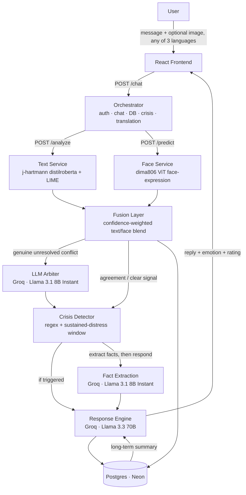

<div align="center">


**An AI journal that reads how you actually feel — through what you write and how you look — and responds like a therapist who remembers your patterns over time.**


**[Live app →](https://moodscript-frontend-2wr445ogxq-uc.a.run.app)**

</div>

---

## What is this?

MoodScript is a full-stack emotional journaling app. You write (or speak, or show your face) how you're feeling, and it:

1. **Detects your emotion** — from your words, and optionally from a photo/webcam frame
2. **Fuses both signals** after calibrating each onto a common confidence scale, weighting each by its measured per-class reliability, and combining them multiplicatively rather than by averaging
3. **Responds as Aria** — a therapist-persona LLM companion that extracts the specific things you actually said before replying, and remembers your last conversation, your last week, and your long-term patterns
4. **Watches for real crisis signals** — and only surfaces helpline resources when something is genuinely serious, never as a reflex
5. **Tracks your wellbeing over time** — a recency-weighted score, trend direction, a weekly reflection letter, and a doctor-ready clinical summary you can export and bring to an appointment
6. **Works in Hindi and Kannada**, and lets you talk to it instead of typing

It's not a chatbot wrapper. Every emotional read is a real model inference (text + vision), fused with confidence-aware logic, with LIME-based explainability behind a "why?" button on every response — and every model and architecture decision in this project was independently benchmarked before shipping, not taken on a vendor's word. See [Research & evaluation](#research--evaluation) below.

## Features

**Emotion intelligence**
- Whole-entry text emotion classification, with a second per-sentence pass that drives the emotion-arc view. Both sentence-level aggregation and a syntax-aware negation rule were shipped earlier and later **removed**: measured on 1,056 held-out journal texts they cost 4.45 points combined, and the negation rule broke 20 correct predictions while fixing none (see [Research & evaluation](#research--evaluation))
- Optional face-image emotion detection (photo upload or webcam), with the face located and cropped before classification — the classifier is trained on close-up faces, and feeding it a full frame with background measurably degrades it
- Calibration-aware log-linear fusion — each modality is first calibrated onto a common confidence scale (the text model was measured to be badly over-confident, ECE 0.217, against 0.015 for the face model, so their raw confidences were never comparable), weighted by a per-class reliability estimate rather than one number, and combined by multiplying rather than averaging so a confident "definitely not this" can actually rule a class out. On a held-out paired benchmark this scores 93.18% against 86.27% for the previous confidence-weighted average — which was itself *below* using the face modality alone (89.30%)
- LLM arbitration on unresolved conflicts — implemented, measured, and now **disabled by default**, because it did not improve accuracy (see [Research & evaluation](#research--evaluation)): it adjudicates by reading the text while never seeing the face image, and text is the weaker signal on exactly those cases. Re-enable with `MOODSCRIPT_ENABLE_ARBITER=1`
- LIME explainability — see exactly which words drove the detected emotion, and a full text/face/fused confidence breakdown on every message

**Conversation & memory**
- Two-pass response generation: a fact-extraction pass pulls out the specific names, events, and details you mentioned first, so Aria's reply is required to engage with what actually happened — not just react to an emotion label
- Multi-turn chat with a consistent persona per conversation (4 distinct therapist voices)
- Long-term pattern summarization injected into every reply — Aria references your actual history, not just the current message
- Full conversation history, browsable per-thread from the sidebar

**Multilingual & voice**
- Full UI and conversation support in English, Hindi, and Kannada — the backend pipeline (emotion detection, crisis checks, storage) always runs in English; your message is translated in and the reply translated back out, so nothing about the underlying analysis changes with language
- Voice input via the Web Speech API — continuous listening with a live recording timer, so it doesn't cut off after one sentence
- Voice output via Google Cloud Text-to-Speech (Neural2 for English/Hindi, WaveNet for Kannada), with speaking rate and pitch conditioned on the detected emotion, so a reply to a sad entry is delivered slower and lower than one to a happy entry. Falls back to the browser voice if the request fails
- Stored content follows the language switch too — the weekly reflection, conversation previews and reopened threads are all translated on read, since journal text is stored canonically in English

**Insight & reflection**
- Recency-weighted wellbeing score (0–100) with trend detection (improving / steady / declining)
- Auto-generated weekly reflection letter, cached per ISO week
- Mood-over-time and emotion-distribution charts on the dashboard, each expandable to full screen; the same panels in the right rail (emotion radar, wellness tips, quote) expand too
- The weekly reflection can be read aloud, and the doctor PDF embeds the mood-over-time graph using the same emotion ranking as the on-screen chart
- Two export options: a full raw journal transcript, or a structured **doctor report** — mood score/trend, emotion distribution, language-pattern signals, safety flags with dates, and a chronological entry list, explicitly framed as a self-reported summary to bring to a healthcare provider, not a diagnosis

**Safety, built deliberately conservative**
- Two-tier crisis detection: explicit-language patterns vs. a 5-entry sustained-distress window
- Crisis resources (India-specific helplines) are hard-coded, never LLM-generated, and only shown when actually triggered — not on every sad message
- Response generation hedges toward neutral instead of committing to a confident narrative when the emotional signal is weak or conflicting — a low-confidence read produces a lighter, more tentative reply, not a fully-committed psychoanalysis of a two-word message

**Account & data**
- JWT auth with PBKDF2-hashed passwords, plus optional Google OAuth
- Light and dark theme, full UI parity in both, every text colour meeting WCAG AA (4.5:1) against its background in each theme
- Responsive down to phone width: the right rail folds under at 1100px and the whole shell stacks with the journal first at 760px
- Full journal export (plain text) and one-click account deletion, cascading through all tables
- Per-user, persistent Postgres storage — not a demo toy that forgets you on restart

## Architecture

The backend is split into three independently deployable services, so each piece can be sized, scaled, and hosted on its own — the orchestrator carries no ML dependencies at all and runs in under 100MB of RAM.



Each service has its own `requirements.txt` and `Dockerfile`:

| Service | Path | What it holds | Approx. RAM |
|---|---|---|---|
| Orchestrator | `main.py` (repo root) | Auth, chat routing, Postgres, Groq calls, crisis/rating logic, translation — zero ML deps | ~95 MB |
| Text service | `services/text_service/` | Text emotion model, spaCy, LIME explainability | ~440 MB |
| Face service | `services/face_service/` | Face-image emotion model | ~400 MB |

The orchestrator talks to the other two over plain HTTP (`FACE_SERVICE_URL`, `TEXT_SERVICE_URL`), authenticated with a shared `INTERNAL_API_KEY` header. All three are deployed independently on Google Cloud Run; the orchestrator runs on Render. See [Deployment](#deployment) below.

## Tech stack

| Layer | Choice |
|---|---|
| Frontend | React 19, Vite, Tailwind, Recharts, `react-webcam`, Web Speech API |
| Backend | FastAPI, Uvicorn |
| Text emotion | `j-hartmann/emotion-english-distilroberta-base` (HF Transformers), whole-entry classification |
| Face emotion | `dima806/facial_emotions_image_detection` (HF Transformers) — see [Research & evaluation](#research--evaluation) for why this model, not the more obvious first pick |
| Fusion arbitration & fact extraction | Groq — Llama 3.1 8B Instant (fast/cheap, one-word or short-list outputs only) |
| Conversational LLM | Groq — Llama 3.3 70B Versatile |
| Translation | Google Cloud Translation API |
| Explainability | LIME |
| Auth | PyJWT + PBKDF2-HMAC-SHA256, optional Google OAuth |
| Storage | PostgreSQL (Neon, serverless), Fernet-encrypted message content |
| Sentence segmentation | spaCy (`en_core_web_sm`) |
| CI/CD | GitHub Actions (path-filtered auto-deploy to Cloud Run) + Render's native GitHub integration |

## Project structure

```
.                               # repo root = backend
├── main.py                     # Orchestrator — auth, chat routing, translation, no ML deps
├── auth.py                     # JWT + password hashing + Google OAuth
├── database/db.py              # Postgres access layer (encrypted message content)
├── models/
│   ├── fusion.py                # Confidence-weighted text + face blending
│   ├── arbiter.py                # LLM arbitration for unresolved fusion conflicts
│   ├── response.py               # Aria persona + two-pass fact-extraction/response prompting
│   ├── crisis.py                  # Crisis detection + helpline resources
│   ├── rating.py                   # Wellbeing score, trend, weekly reflection
│   ├── report.py                    # Doctor-report export builder
│   └── translate.py                  # Google Cloud Translation wrapper (single + batch)
├── services/
│   ├── text_service/             # Standalone: text emotion model + LIME
│   │   └── main.py, text_model.py, explainer.py, requirements.txt, Dockerfile
│   └── face_service/             # Standalone: face emotion model
│       └── main.py, face_model.py, requirements.txt, Dockerfile
├── research/                    # Benchmarking & evaluation harnesses (see below)
│   ├── eval_face_models.py, eval_text_model.py, eval_text_candidates.py
│   ├── eval_fusion.py, eval_arbiter.py, eval_two_pass.py, eval_llm_ab.py
│   ├── compare_models.py         # Paired McNemar's significance testing
│   └── results/                   # Raw predictions, confusion matrices, JSON reports
├── .github/workflows/            # Path-filtered auto-deploy to Cloud Run
├── Dockerfile                    # Orchestrator's own Dockerfile
└── frontend/                     # React app (Vite) — the only frontend directory
    └── src/
        ├── App.jsx, api.js, i18n.js, useSpeechRecognition.js
        └── components/            # Sidebar, Dashboard, ChatInput, XAIDrawer, ThemeSwitcher, LanguageSwitcher, ...
```

## Running it locally

Three separate processes — orchestrator, text service, face service:

```bash
# Text service
cd services/text_service
python3 -m venv venv && source venv/bin/activate
pip install torch --index-url https://download.pytorch.org/whl/cpu
pip install -r requirements.txt && python -m spacy download en_core_web_sm
uvicorn main:app --reload --port 8002

# Face service (separate venv/shell)
cd services/face_service
python3 -m venv venv && source venv/bin/activate
pip install torch torchvision --index-url https://download.pytorch.org/whl/cpu
pip install -r requirements.txt
uvicorn main:app --reload --port 8001

# Orchestrator (separate venv/shell, from repo root)
python3 -m venv venv && source venv/bin/activate
pip install -r requirements.txt
# .env: GROQ_API_KEY=..., JWT_SECRET=..., DATABASE_URL=postgresql://...,
#       MESSAGE_ENCRYPTION_KEY=..., FACE_SERVICE_URL=http://localhost:8001,
#       TEXT_SERVICE_URL=http://localhost:8002, INTERNAL_API_KEY=...,
#       GOOGLE_TRANSLATE_CREDENTIALS=... (optional, for multilingual),
#       GOOGLE_CLIENT_ID=... (optional, for Google sign-in)
uvicorn main:app --reload --port 8000
```

**Frontend**
```bash
cd frontend
npm install
npm run dev
```

## API reference

| Endpoint | Description |
|---|---|
| `POST /auth/signup`, `POST /auth/login`, `POST /auth/google` | Account auth, returns a JWT |
| `POST /chat` | Send a message (+ optional image, + `lang`), get emotion + Aria's reply |
| `POST /translate` | Batch-translate arbitrary UI/dynamic content (used for wellness tips, quotes) |
| `POST /speak` | Synthesize speech for a reply (`text`, `lang`, `emotion`), returns MP3 with emotion-conditioned prosody |
| `GET /conversations`, `GET /conversations/{id}/messages` | Past conversations |
| `GET /history`, `GET /rating` | Mood log, wellbeing score + trend |
| `GET /reflection` | This week's auto-generated reflection letter |
| `GET /export` | Download your full journal as text |
| `GET /export/doctor-report` | Download a structured clinical-style summary for a healthcare provider |
| `DELETE /account` | Delete your account and all associated data |

## Deployment

Every part of the app deploys automatically on push to `main` — no manual `gcloud` or `render` commands required day-to-day:

- **Frontend, face service, text service** (Cloud Run) — each has its own path-filtered GitHub Actions workflow (`.github/workflows/deploy-*.yml`) that only fires when that service's own directory changes, using a dedicated `github-actions-deployer` service account with least-privilege IAM roles. Credentials live only as GitHub secrets, never in the repo.
- **Orchestrator** (Render) — deploys via Render's native GitHub integration, no workflow needed.

| Service | Live URL |
|---|---|
| Frontend | https://moodscript-frontend-2wr445ogxq-uc.a.run.app |
| Orchestrator | https://moodscript-backend.onrender.com |
| Face service | https://moodscript-face-service-2wr445ogxq-uc.a.run.app |
| Text service | https://moodscript-text-service-2wr445ogxq-uc.a.run.app |

## Research & evaluation

Every model swap and architecture change in this project was independently benchmarked before shipping — self-reported model-card numbers and vendor pricing claims are treated as claims to verify, not facts to build on. Full methodology, raw predictions, and confusion matrices are in `research/`.

**Face model: `dima806/facial_emotions_image_detection`, not the more obvious first pick.** Both candidates were evaluated on the real FER2013 test split (7,178 images, not either card's self-reported number):

| Model | Accuracy | Angry precision/recall |
|---|---|---|
| `trpakov/vit-face-expression` (original) | 71.15% (independently reproduced — matches its claimed 71.16%) | 62.7% / 64.3% |
| `dima806/facial_emotions_image_detection` (current) | **88.35%** | **87.0% / 87.9%** |

Paired McNemar's test: p = 8.5×10⁻²⁰⁶ — not remotely due to chance. The angry-class gap directly explains a real failure caught during manual testing (an exaggerated angry expression scoring 0% angry on the old model, split between happy and fearful instead).

**Fusion: the previous rule was measurably worse than one modality alone.** Evaluated on a purpose-built paired benchmark — a GoEmotions or EmpatheticDialogues text labelled *X* paired with a FER2013 face labelled *X*, so ground truth is unambiguous and disagreement arises from real model error rather than manufactured conflict:

| Strategy | Set A (n=577) | Set B (n=1,056) |
|---|---|---|
| Face only | 88.39% | 89.30% |
| Confidence-weighted average (previous) | 83.36% | 86.27% |
| **Calibration-aware log-linear (current)** | **91.51%** | **93.18%** |

Significant against the previous rule (p = 3.1×10⁻⁸ / 1.5×10⁻¹³) and against the stronger single modality (p = 0.0013 / 7.0×10⁻⁷). These numbers come from running the shipped `models/fusion.py` itself (`research/verify_production_fusion.py`), not a research reimplementation. An ablation isolates text calibration as the dominant factor (+8.54 pp); face calibration contributes +0.39 pp because that model was already calibrated.

**LLM arbitration: tested and does not help.** Four designs — direct classification, binary choice given the correct reliability prior, confidence-gated abstention, and meta-linguistic trust scoring — all scored below fusion without an LLM on the conflict cases where arbitration fires (best 75.40% against 76.98%). The arbiter reads the *text* and only ever receives the face model's label, never the image, and text is worth ~17% accuracy on exactly those cases. Its trust estimates were uncorrelated with whether the text was actually right (0.738 when right, 0.763 when wrong). Now disabled by default (`MOODSCRIPT_ENABLE_ARBITER=1` re-enables it); the code and the evaluation both remain in the repo. See `research/eval_arbiter_v2.py`.

**Text model: kept, not swapped.** Two candidates were tested on GoEmotions *and* cross-checked against a 49-case journal-style benchmark, since a model's benchmark win doesn't necessarily generalize to the product's actual input distribution:

| Model | GoEmotions | Journal-style (49 cases) |
|---|---|---|
| Current (`j-hartmann` distilroberta) | 43.75% | **78%** |
| `SamLowe/roberta-base-go_emotions` (native GoEmotions model) | 69.65% | 71% |
| `j-hartmann/emotion-english-roberta-large` | 47.34% | — |

SamLowe wins big on GoEmotions (expected — it's trained directly on it) but loses on the benchmark that resembles real usage. Kept the current model.

**Text pipeline: two of our own ideas, both removed on evidence.** The checkpoint above was the right choice; the hand-written wrapper around it was not. Re-measured on 1,056 held-out journal-domain texts — 21× the 49-case set the wrapper was tuned against:

| Variant | Accuracy |
|---|---|
| Whole entry, no wrapper | **64.49%** |
| Sentence-split + position/length/confidence-weighted aggregation | 60.80% |
| The above + syntax-aware negation dampening (previously shipped) | 60.13% |

Sentence splitting cost 3.7 points — these entries average ~22 words, so segmentation discards the context the classifier needs and then recombines the fragments with coefficients never fitted to anything. Negation dampening cost a further 1.89 points: it changed 32 labels, **broke 20 correct predictions and fixed zero**, having validated at +6 points on the 49 hand-written cases it was both tuned and tested on. Removing both improved accuracy 60.04% → 64.49% (McNemar p = 1.1×10⁻⁶) *and* cut latency from 174 ms to 40 ms per entry, since the whole-entry pass replaces the per-sentence work rather than adding to it. Re-runnable via `research/eval_text_pipeline_ablation.py` and `research/eval_text_model_v2.py`.

A larger checkpoint (`j-hartmann/emotion-english-roberta-large`) reaches 67.33% on the same split but peaks at 1.82 GB resident against the text service's 2 GiB Cloud Run cap, so it was measured and rejected on memory grounds rather than quietly ignored.

The 49 journal-style cases are checked into the repo at `research/data/journal_tests_49.json` (labelled by category: clear, negation, sarcasm, mixed, short, long-arc), and both sides of that comparison are re-runnable — `research/eval_deployed_journal.py` for the shipped pipeline and `research/eval_samlowe_journal.py` for the candidate. Neither model handles sarcasm at all (0/2 for both), which is the clearest known limitation of the text stage and part of why LLM arbitration exists downstream.

**LLM choice: kept Llama 3.3 70B, not `gpt-oss-120b`.** A/B tested on the real production prompt: `gpt-oss-120b`'s cheaper headline per-token price was misleading once measured — it's a reasoning model that burns hidden tokens before answering, making it ~2.8x more expensive per response in practice (415.75 avg completion tokens vs. 113.5) and ~57% slower.

**Fusion & response-generation improvements, both shipped:**
- Confidence-weighted fusion improves calibration over the original fixed 55/45 split without hurting top-1 accuracy on constructed conflict cases — but doesn't fix a confidently-wrong prediction from a weak model class, which is why the face-model swap above still mattered separately.
- The two-pass fact-extraction response split measurably improves content-specificity: entity-hit-rate (does the reply reference concrete details from the input) went from 0.35 to 0.60 on the same test cases.

## Team

| Name |
|---|
| Aadithya A R |
| Kenisha P |
| Shreya V |
| Pranathi N |
