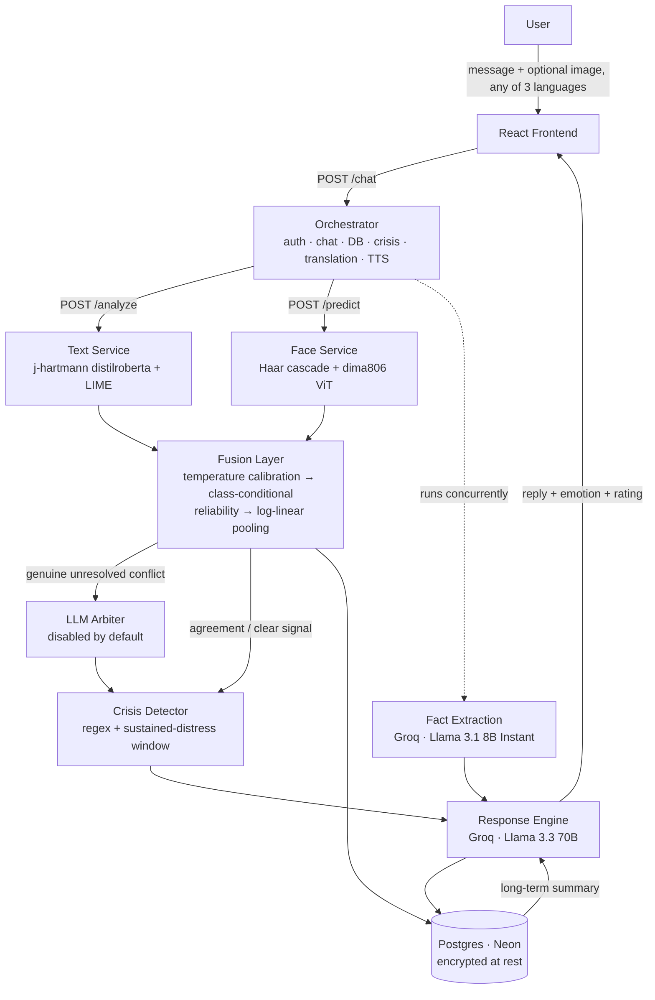

<div align="center">


**An AI journal that reads how you actually feel — through what you write and how you look — and responds like a therapist who remembers your patterns over time.**


**[Live app →](https://moodscript-frontend-2wr445ogxq-uc.a.run.app)**

</div>

---

## What is this?

MoodScript is a full-stack emotional journaling app. You write (or speak, or show your face) how you're feeling, and it:

1. **Detects your emotion** — from your words, and optionally from a photo/webcam frame
2. **Fuses both signals** after temperature-calibrating each onto a common confidence scale, weighting each by its measured per-class reliability, and combining them multiplicatively rather than by averaging
3. **Responds as Aria** — a therapist-persona LLM companion that extracts the specific things you actually said before replying, and remembers your last conversation, your last week, and your long-term patterns
4. **Watches for real crisis signals** — and only surfaces helpline resources when something is genuinely serious, never as a reflex
5. **Tracks your wellbeing over time** — a recency-weighted score, trend direction, a weekly reflection letter, and a doctor-ready clinical summary you can export
6. **Scores your entry as a soundtrack** — a three-stage mood arc built on the iso-principle from music therapy
7. **Works in Hindi and Kannada**, and lets you talk to it instead of typing

It's not a chatbot wrapper. Every emotional read is a real model inference (text + vision), fused with calibration-aware logic, with LIME-based explainability behind a "why?" button on every response — and every model and architecture decision was independently benchmarked before shipping. See [Research & evaluation](#research--evaluation).

**This project also produced a paper.** The research question it ended up answering is narrower and more interesting than the product: *when you combine two independently trained classifiers, does it matter more how you combine them, or how well calibrated they are?*

---

## The headline finding

The original fusion rule was a confidence-weighted linear blend — the obvious design, and the one most tutorials show. It performed **worse than using the face model alone**: 83.36% against 88.39%. Fusion was destroying information.

The cause was a calibration mismatch. Expected Calibration Error measures the gap between stated confidence and actual accuracy:

| Modality | ECE before | ECE after temperature scaling |
|---|---|---|
| Text (DistilRoBERTa) | **0.235** — badly overconfident | 0.035 |
| Face (ViT) | **0.029** — already well calibrated | 0.040 |

A confidence-weighted rule treats "0.9 from the text model" and "0.9 from the face model" as equal evidence. They are not. The rule systematically over-trusted the worse-calibrated modality and dragged the better one down.

Fixing it — temperature scaling before combination — lifted every classical combination rule tested, by between 1.67 and 7.11 percentage points.

> **The honest version of the claim:** calibration improves every rule tested, on both benchmarks. An earlier draft claimed calibration mattered *more than* the choice of rule; a proper 2×4 factorial does not support that. On Set A the main effect of rule choice (4.42 pp) actually exceeds that of calibration (3.16 pp); on Set B calibration wins by 0.24 pp, which is noise. The claim that survives is the first one.

---

## Features

**Emotion intelligence**
- Whole-entry text emotion classification, with a second per-sentence pass that drives the emotion-arc view and the soundtrack. Sentence-level aggregation and a syntax-aware negation rule were both shipped earlier and later **removed** on evidence — see [Research & evaluation](#research--evaluation)
- Optional face-image emotion detection (photo upload or webcam), with the face located and cropped before classification — the classifier is trained on close-up faces, and feeding it a full frame with background measurably degrades it
- Calibration-aware log-linear fusion, weighted by a per-class reliability estimate rather than a single number, and combined by multiplying rather than averaging so a confident "definitely not this" can rule a class out
- LLM arbitration on unresolved conflicts — implemented, measured, and **disabled by default** because it did not improve accuracy. Re-enable with `MOODSCRIPT_ENABLE_ARBITER=1`
- LIME explainability — which words drove the detected emotion, plus a full text/face/fused confidence breakdown on every message

**Conversation & memory**
- Two-pass response generation: a fact-extraction pass pulls out the specific names, events and details you mentioned first, so Aria's reply must engage with what actually happened rather than react to an emotion label. The extraction pass runs **concurrently** with the emotion pipeline, so it adds no sequential latency
- Multi-turn chat with a consistent persona per conversation (4 distinct therapist voices)
- Long-term pattern summarization injected into every reply
- Full conversation history, browsable per-thread

**Soundtrack (iso-principle)**
- Emotion → playlist is the obvious design and the harmful one: sad music can entrench rumination, cheerful music reads as dismissal. Music therapy's iso-principle says meet the listener where they are, then move gradually
- Three stages — **MEET** (matches the entry's opening emotion) → **BRIDGE** (halfway) → **LIFT** (a gentler target state) — resolved to real tracks via the Jamendo API
- Driven by the per-sentence `emotion_arc`, so an entry running anxious → resolved is scored as a trajectory, not a single label
- **Anger calms before it lifts.** The naive mapping raises valence first, answering an angry entry with upbeat music; the anger path drops energy first, then moves valence
- **Crisis suppresses it entirely.** Someone in crisis needs a helpline, not a playlist

**Multilingual & voice**
- Full UI and conversation support in English, Hindi and Kannada. The backend pipeline always runs in English — your message is translated in and the reply translated back out, so nothing about the analysis changes with language
- Voice input via the Web Speech API, continuous listening with a live recording timer
- Voice output via Google Cloud TTS (Neural2 for English/Hindi, WaveNet for Kannada), with rate and pitch conditioned on the detected emotion. Falls back to the browser voice on failure
- Stored content follows the language switch — reflections, previews and reopened threads translate on read

**Insight & reflection**
- Recency-weighted wellbeing score (0–100) with trend detection (improving / steady / declining)
- Auto-generated weekly reflection letter, cached per ISO week, readable aloud
- Mood-over-time and emotion-distribution charts, each expandable to full screen
- Two exports: a full raw journal transcript, or a structured **doctor report** — mood score/trend, emotion distribution, language-pattern signals, safety flags with dates, and a chronological entry list, explicitly framed as a self-reported summary, not a diagnosis

**Safety, deliberately conservative**
- Two-tier crisis detection: 11 explicit-language regex patterns, plus a sustained-distress window (five most recent entries all negative with confidence > 0.55)
- Crisis resources (India-specific helplines) are **hard-coded, never LLM-generated**, and shown only when triggered. A generative model can hallucinate a helpline number; static text cannot
- Response generation hedges toward neutral when the emotional signal is weak or conflicting, rather than committing to a confident narrative about a two-word message

**Account & data**
- JWT auth with PBKDF2-hashed passwords, plus optional Google OAuth
- Fernet-encrypted message and reflection content at rest
- Light and dark theme, every text colour meeting WCAG AA (4.5:1) in both
- Responsive: right rail folds under at 1100px, full stack at 760px
- Full journal export and one-click account deletion, cascading through all tables

---

## Architecture

The backend splits into three independently deployable services, so each can be sized and scaled on its own — the orchestrator carries no ML dependencies and runs in under 100 MB.



**Why split at all.** The two ML models need ~2 GiB each and take seconds to cold-start. The orchestrator must be small and always warm. Bundling would make every request pay for models it may not use, and a text-only request would still load the ViT. Splitting also lets the text and face calls run concurrently.

**Why the orchestrator is on Render and everything else on Cloud Run.** Cloud Run scales to zero, which suits bursty, expensive, cold-start-tolerant ML services. The orchestrator holds auth state and must answer fast every time, so it runs always-on.

| Service | Path | What it holds | Approx. RAM |
|---|---|---|---|
| Orchestrator | `main.py` (repo root) | Auth, chat routing, Postgres, Groq, crisis/rating, translation, TTS — zero ML deps | ~95 MB |
| Text service | `services/text_service/` | Text emotion model, spaCy, LIME | ~440 MB |
| Face service | `services/face_service/` | Haar cascade + face emotion model | ~400 MB |

The orchestrator talks to the other two over plain HTTP (`FACE_SERVICE_URL`, `TEXT_SERVICE_URL`), authenticated with a shared `INTERNAL_API_KEY` header.

### The fusion layer

Production constants, fitted on a pooled calibration split of **1,831 examples**:

```python
TEXT_TEMPERATURE = 1.6990      # τ > 1 → softens overconfidence
FACE_TEMPERATURE = 0.9171      # τ < 1 → slightly sharpens
TEXT_WEIGHT, FACE_WEIGHT = 0.55, 0.45
```

Class-conditional reliability, with Laplace smoothing — one estimate per (modality, class) rather than one scalar per model:

```
r_m(c) = (hits_m(c) + λ·acc_m) / (n_m(c) + λ),   λ = 5
```

Per-sample weights, then log-linear (product-of-experts) pooling:

```
a_T = w_T · r_T(y_T) · max(T̃)        â_T = a_T / (a_T + a_F)
a_F = w_F · r_F(y_F) · max(F̃)        â_F = a_F / (a_T + a_F)

log P_fused(e) ∝ â_T·log T̃(e) + â_F·log F̃(e)
```

Log-linear rather than linear matters: linear pooling averages, so a confidently wrong model still drags the result. Log-linear is a product of experts — a class needs support from *both* modalities to survive. This is why the product rule beats the sum rule on both benchmarks, consistent with Kittler et al. (1998).

Each fused result carries a `resolution_reason`: `agreement`, `dominant_confidence_text|face`, `text_override`, `face_override`, `conflict_resolved_to_X`, or `text_only`.

---

## Tech stack

| Layer | Choice |
|---|---|
| Frontend | React 19, Vite, Tailwind, Recharts, `react-webcam`, Web Speech API |
| Backend | FastAPI, Uvicorn |
| Text emotion | `j-hartmann/emotion-english-distilroberta-base`, whole-entry classification |
| Face detection | OpenCV Haar cascade (largest face, margin crop) |
| Face emotion | `dima806/facial_emotions_image_detection` (ViT) |
| Fact extraction & arbitration | Groq — Llama 3.1 8B Instant |
| Conversational LLM | Groq — Llama 3.3 70B Versatile |
| Music | Jamendo API, pool-cached (TTL 3600) with prewarm |
| Translation / TTS | Google Cloud Translation, Google Cloud Text-to-Speech |
| Explainability | LIME |
| Auth | PyJWT + PBKDF2-HMAC-SHA256, optional Google OAuth |
| Storage | PostgreSQL (Neon), Fernet-encrypted message content |
| Sentence segmentation | spaCy (`en_core_web_sm`) |
| CI/CD | GitHub Actions (path-filtered auto-deploy) |

---

## Project structure

```
.                               # repo root = backend
├── main.py                     # Orchestrator — auth, chat routing, translation, no ML deps
├── auth.py                     # JWT + password hashing + Google OAuth
├── database/db.py              # Postgres access layer (Fernet-encrypted content)
├── models/
│   ├── fusion.py               # Calibration-aware log-linear fusion (production constants)
│   ├── arbiter.py              # LLM arbitration — disabled by default
│   ├── response.py             # Aria persona + two-pass extraction/response prompting
│   ├── crisis.py               # Crisis detection + hard-coded helpline resources
│   ├── music.py                # Iso-principle mood-arc soundtrack
│   ├── jamendo.py              # Jamendo client, pool cache + prewarm
│   ├── rating.py               # Wellbeing score, trend, weekly reflection
│   ├── report.py               # Doctor-report PDF builder
│   ├── translate.py            # Google Cloud Translation wrapper
│   └── tts.py                  # Google Cloud Text-to-Speech
├── services/
│   ├── text_service/           # Standalone: text emotion model + LIME
│   └── face_service/           # Standalone: Haar cascade + face emotion model
├── research/                   # Benchmarking & evaluation harnesses
│   ├── build_paired_set.py, add_neutral_pairs.py     # benchmark construction
│   ├── fit_fusion_constants.py                        # fits the production constants
│   ├── eval_classical_rules.py                        # Kittler sum/product/max/min comparison
│   ├── eval_reliability_subgroups.py                  # conflict-case + per-class analysis
│   ├── eval_face_models.py, eval_text_candidates.py, eval_text_pipeline_ablation.py
│   ├── eval_arbiter_v2.py, eval_two_pass.py, eval_llm_ab.py, eval_ablation.py
│   ├── verify_production_fusion.py                    # runs the SHIPPED fusion.py
│   └── results/                                       # raw predictions, JSON reports
├── .github/workflows/          # Path-filtered auto-deploy (3× Cloud Run, 1× Render)
├── Dockerfile
└── frontend/                   # React app (Vite) — the only frontend directory
    └── src/
        ├── App.jsx, api.js, i18n.js, useSpeechRecognition.js
        └── components/
```

---

## Running it locally

Three separate processes — orchestrator, text service, face service:

```bash
# Text service
cd services/text_service
python3 -m venv venv && source venv/bin/activate
pip install torch --index-url https://download.pytorch.org/whl/cpu
pip install -r requirements.txt && python -m spacy download en_core_web_sm
uvicorn main:app --reload --port 8002

# Face service (separate venv/shell)
cd services/face_service
python3 -m venv venv && source venv/bin/activate
pip install torch torchvision --index-url https://download.pytorch.org/whl/cpu
pip install -r requirements.txt
uvicorn main:app --reload --port 8001

# Orchestrator (separate venv/shell, from repo root)
python3 -m venv venv && source venv/bin/activate
pip install -r requirements.txt
uvicorn main:app --reload --port 8000
```

`.env` for the orchestrator:

```
GROQ_API_KEY=...
JWT_SECRET=...
DATABASE_URL=postgresql://...
MESSAGE_ENCRYPTION_KEY=...          # Fernet key
FACE_SERVICE_URL=http://localhost:8001
TEXT_SERVICE_URL=http://localhost:8002
INTERNAL_API_KEY=...
JAMENDO_CLIENT_ID=...               # optional, for the soundtrack
GOOGLE_TRANSLATE_CREDENTIALS=...    # optional, for multilingual
GOOGLE_CLIENT_ID=...                # optional, for Google sign-in
MOODSCRIPT_ENABLE_ARBITER=1         # optional, re-enables LLM arbitration
MOODSCRIPT_LEGACY_FUSION=1          # optional, restores the old linear rule
```

**Frontend**
```bash
cd frontend
npm install
npm run dev
```

---

## API reference

| Endpoint | Description |
|---|---|
| `POST /auth/signup`, `/auth/login`, `/auth/google` | Account auth, returns a JWT |
| `POST /chat` | Send a message (+ optional image, + `lang`), get emotion + Aria's reply |
| `POST /translate` | Batch-translate arbitrary UI/dynamic content |
| `POST /speak` | Synthesize speech (`text`, `lang`, `emotion`) → MP3 with emotion-conditioned prosody |
| `POST /soundtrack` | Mood-arc soundtrack for an entry (MEET → BRIDGE → LIFT) |
| `GET /soundtrack/weekly` | Soundtrack built from the week's emotion distribution |
| `GET /conversations`, `/conversations/{id}/messages` | Past conversations |
| `DELETE /conversations/{id}` | Delete a thread |
| `GET /history`, `/rating` | Mood log, wellbeing score + trend |
| `GET /reflection` | This week's auto-generated reflection letter |
| `GET /export` | Full journal as text |
| `GET /export/doctor-report` | Structured clinical-style summary PDF |
| `DELETE /account` | Delete account and all associated data |
| `GET /health` | Health check — reports the running commit SHA |

---

## Deployment

Everything deploys automatically on push to `main`.

- **Frontend, text service, face service** (Cloud Run) — each has a path-filtered GitHub Actions workflow that fires only when its own directory changes, using a least-privilege `github-actions-deployer` service account. Credentials live only as GitHub secrets.
- **Orchestrator** (Render) — its workflow does three things in order: validate (byte-compile every module), deploy, then **prove the deploy landed** by polling `/health` until it reports the pushed commit SHA. A deploy that silently fails to roll out fails the build instead of passing quietly.

| Service | Live URL |
|---|---|
| Frontend | https://moodscript-frontend-2wr445ogxq-uc.a.run.app |
| Orchestrator | https://moodscript-backend.onrender.com |
| Face service | https://moodscript-face-service-2wr445ogxq-uc.a.run.app |
| Text service | https://moodscript-text-service-2wr445ogxq-uc.a.run.app |

---

## Research & evaluation

Every model swap and architecture change was independently benchmarked before shipping — self-reported model-card numbers are treated as claims to verify, not facts to build on. Full methodology, raw predictions and confusion matrices are in `research/`.

### Benchmarks

Two constructed paired sets — text and face examples drawn independently and matched by emotion label, so ground truth is unambiguous and disagreement arises from real model error rather than manufactured conflict:

| | Set A | Set B |
|---|---|---|
| Text source | GoEmotions | EmpatheticDialogues + DailyDialog (neutral) |
| Face source | FER2013 test split | FER2013 test split |
| Pairs | 1,153 | 2,511 |
| Calibration / test | 576 / 577 | 1,255 / 1,256 |

Set B originally had no neutral class (EmpatheticDialogues has none), so 400 neutral pairs were added from DailyDialog — 200 into calibration, 200 into test, which is why the test split went from 1,056 to 1,256.

### Fusion comparison

Accuracy, with McNemar *p* against face-only prediction:

| Method | Set A (n=577) | Set B (n=1,256) |
|---|---|---|
| Text only | 49.74% (<.001) | 64.57% (<.001) |
| **Face only** | **88.39%** (ref.) | **88.69%** (ref.) |
| Sum rule | 87.69% (.688) | 89.17% (.668) |
| Product rule | 90.29% (.208) | 91.00% (.023) |
| Max rule | 86.83% (.272) | 88.14% (.606) |
| Min rule | 85.10% (.085) | 88.30% (.772) |
| Sum + calibration | 89.77% (.061) | 92.12% (<.001) |
| **Product + calibration** | **92.03%** (<.001) | 92.68% (<.001) |
| Confidence-weighted linear (previous) | 83.36% (.002) | 85.83% (.011) |
| Weighted calibrated log-linear (deployed) | 90.47% (.010) | **92.83%** (<.001) |

After **Holm–Bonferroni correction** across all 18 comparisons, the calibrated product rule is the only fusion rule that remains significant on both sets. These numbers come from running the shipped `models/fusion.py` itself (`research/verify_production_fusion.py`), not a research reimplementation.

**Component ablation** (all 16 on/off combinations, marginal effects):

| Component | Δ Accuracy | Δ ECE |
|---|---|---|
| **Text calibration** | **+8.54 pp** | +0.053 |
| Confidence weighting | +2.64 pp | −0.039 |
| Face calibration | +0.39 pp | −0.001 |
| Post-fusion calibration | +0.00 pp | −0.163 |

Text calibration dominates because the text branch was the badly calibrated one. Face calibration barely moves accuracy, and its ECE actually got slightly worse (0.029 → 0.040) — the useful intervention is specifically calibrating the *text* branch.

### Negative results

**Class-conditional reliability weighting does not beat a plain calibrated product rule.** The intuition was sound — the text model is far more reliable on some classes than others — but it did not hold up:

| | Weighted rule | Unweighted calibrated product | p |
|---|---|---|---|
| Set A | 90.47% | **92.03%** | 0.0265 (loses) |
| Set B | 92.83% | 92.68% | 0.8231 (tie) |
| Set A conflict cases (n=323) | 83.59% | **86.38%** | 0.0265 |
| Set B conflict cases (n=528) | 84.66% | 84.28% | 0.8231 |

Per-class it lost 5.0 pp of recall on neutral — the class with the *lowest* text reliability, which is the opposite of the intended effect. It remains the deployed configuration, which is an honest inconsistency: the deployment predates the evaluation that showed a simpler rule is as good. `research/eval_reliability_subgroups.py`.

**LLM arbitration does not help.** Four designs — direct classification, binary choice given the correct reliability prior, confidence-gated abstention, and meta-linguistic trust scoring — all scored below deterministic fusion on the 126 conflict cases where arbitration fires:

| Approach | Accuracy on conflicts |
|---|---|
| **Deterministic fusion, no LLM** | **76.98%** |
| Best LLM design (trust-weighted) | 75.40% |
| Face-only | 71.43% |
| Previous numeric fusion | 48.41% |
| LLM arbiter (7-way classify) | 46.83% |

The diagnostic: the arbiter's trust estimate was 0.738 when the text was right and 0.763 when it was wrong — **no signal at all**. The arbiter reads the text and only ever receives the face model's *label*, never the image, and text is the weaker signal on exactly those cases. Disabled by default. `research/eval_arbiter_v2.py`.

**Two of our own text-pipeline ideas, both removed on evidence.** Measured on 1,256 held-out journal-domain texts:

| Variant | Accuracy |
|---|---|
| **Whole entry, no wrapper** | **64.57%** |
| Sentence-split + weighted aggregation | 62.98% |
| The above + syntax-aware negation dampening (previously shipped) | 62.58% |

Removing both is worth 1.99 points and cuts latency from 174 ms to 40 ms per entry. Sentence splitting discards the context the classifier needs — entries average ~22 words — then recombines fragments with coefficients never fitted to anything.

*A caveat worth stating rather than burying:* an earlier version of this ablation reported the negation rule as breaking 20 correct predictions while fixing none. That was inflated — a rule whose whole mechanism pushes probability toward neutral can only score as damage on a benchmark with no neutral examples. Re-measured with neutral present it breaks 8 and fixes 3, and neither component is individually significant (p = 0.065 and 0.228); only their combined effect is. The decision to remove them stands; the strength of the evidence does not.

### Model selection

**Face: `dima806/facial_emotions_image_detection`.** Both candidates evaluated on the real FER2013 test split (7,178 images, not either card's self-reported number):

| Model | Accuracy | Macro-F1 | Angry F1 | Inference |
|---|---|---|---|---|
| `trpakov/vit-face-expression` | 71.15% | 69.90% | 63.5% | 459 s |
| **`dima806/...`** | **88.35%** | **88.90%** | **87.4%** | 630 s |

+17.20 pp, McNemar χ² = 937.08, p = 8.53×10⁻²⁰⁶. The angry-class gap explains a real failure caught in manual testing — an exaggerated angry expression scoring 0% angry on the old model. The new model is ~37% slower, which is irrelevant at one image per entry.

**Text: kept `j-hartmann`, not swapped.**

| Model | GoEmotions (n=4,590) | Journal (n=49) | Journal (n=1,056) |
|---|---|---|---|
| **`j-hartmann` distilroberta (current)** | 43.75% | **77.6%** | **64.49%** |
| `SamLowe/roberta-base-go_emotions` | **69.65%** | 71.4% | 52.65% |
| `j-hartmann/emotion-english-roberta-large` | 47.34% | — | 67.33% |

SamLowe wins the public benchmark by 26 points and loses on journal text. **Caveat:** SamLowe is fine-tuned on GoEmotions alone, and the deployed model saw GoEmotions as one of six training corpora — so that column is not an independent comparison, which is exactly why the journal result is the informative one.

The larger checkpoint reaches 67.33% but peaks at 1.82 GB resident against the text service's 2 GiB cap, so it was measured and rejected on memory grounds rather than quietly ignored.

The 49 journal cases are checked in at `research/data/journal_tests_49.json`, labelled by category (clear, negation, sarcasm, mixed, short, long-arc). Neither model handles sarcasm at all (0/2 for both) — the clearest known limitation of the text stage.

**LLM: kept Llama 3.3 70B over `gpt-oss-120b`.** A/B tested on the real production prompt. The cheaper headline per-token price was misleading — `gpt-oss-120b` is a reasoning model that burns hidden tokens before answering, making it ~2.8× more expensive per response in practice (415.75 vs 113.5 average completion tokens) and ~57% slower (1.29 s vs 0.82 s, n=4 per model — an engineering observation, not a controlled experiment).

**Two-pass response generation, shipped.** Splitting fact extraction from response generation raised the entity-hit rate — does the reply reference concrete details from the input — from **0.35 to 0.60** on the same test cases.

### Known limitations

Stated rather than buried:

1. **The paired benchmarks are constructed.** Text and face examples come from different datasets, matched by emotion label; they are never simultaneous observations of the same person. This cannot test real cross-modal disagreement, temporal alignment or speaker consistency. Proper validation needs a genuinely paired corpus such as IEMOCAP or CMU-MOSEI.
2. **Both benchmarks share FER2013 faces**, so they are less independent than "two benchmarks" suggests.
3. **The GoEmotions comparison is confounded** by both checkpoints' training exposure.
4. **n=49** for the headline journal comparison; the 1,056-entry version is the stronger evidence.
5. **Production runs a fusion rule the evaluation shows is not better** than a simpler one.
6. **No user study or clinical validation.** No claim about therapeutic effectiveness is supported. The system is positioned as supportive and documentation-oriented, explicitly not diagnostic.
7. **The DailyDialog neutral subset** is dialogue turns while the rest of Set B is first-person narrative — a mild domain shift the other six classes don't carry.

---

## Team

| Name | Role |
|---|---|
| Aadithya A R | Dept. of CSE (AI & ML), Global Academy of Technology |
| Kenisha P | Dept. of CSE (AI & ML), Global Academy of Technology |
| Shreya V | Dept. of CSE (AI & ML), Global Academy of Technology |
| Pranathi N | Dept. of CSE (AI & ML), Global Academy of Technology |
| Saranya Babu | Guide, Dept. of CSE (AI & ML), Global Academy of Technology |
